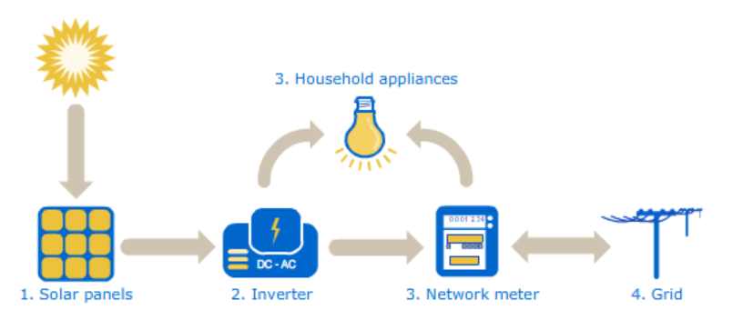

# Análisis de anomalías en plantas solares fotovoltaicas

Análisis exploratorio de datos (EDA) orientado a investigar comportamientos inusuales en la generación eléctrica de dos plantas solares fotovoltaicas. El análisis usa mediciones de generación y sensores ambientales registradas cada 15 minutos durante 34 días.

> Diccionario de términos y campos: [`docs/diccionario.md`](docs/diccionario.md)

## Hallazgos clave

- La **captación solar no muestra anomalías**: la irradiación y las temperaturas son comparables entre ambas plantas.
- La **Planta 2 tiene baches de indisponibilidad real de datos** (irradiación media o alta con potencia DC y AC cercana a cero) entre el 20/05 y el 29/05.
- Hay **pérdida de registros** en ambas plantas y **cuatro inverters de la Planta 2** que pierden más datos que el resto. Se recomienda una revisión fisica de los dispositivos y una nueva extracción de datos.

## Resumen ejecutivo

Una compañía de generación solar detectó comportamientos inusuales en dos plantas y solicitó analizar los datos antes de enviar un equipo de mantenimiento. El proyecto integra datos de generación de inverters y datos meteorológicos, revisa su calidad temporal, prepara variables derivadas y compara el comportamiento de ambas plantas. 

## Problema

La generación de una planta solar depende de la irradiación (cantidad de sol), la temperatura, el estado de los paneles, la eficiencia de los inverters y la fiabilidad de los sensores y medidores. Los datos extraidos presentan tramos horarios faltantes y patrones diferentes entre plantas, lo que puede ocultar fallos o sesgar las comparaciones. 

## Cómo funciona una planta solar



1. **Paneles solares**: las celdas fotovoltaicas convierten la irradiación solar en corriente continua (DC). A mayor irradiación y menor temperatura de celda, mayor potencia DC.
2. **Inverter**: transforma la corriente continua (DC) en corriente alterna (AC), utilizable por la red y los consumos. La relación `AC / DC` es la *eficiencia del inverter*.
3. **Medidor de red**: registra la energía AC que entra y sale de la instalación.
4. **Red y consumos**: la energía se autoconsume o se inyecta a la red.

Un problema de producción puede originarse en cualquier eslabón: menos irradiación por el clima, celdas degradadas, un inverter con baja eficiencia, o un sensor o medidor que no registra. El análisis busca separar un **fallo real de operación** de un **fallo de medición o de disponibilidad de datos**.

## Objetivo

Localizar los problemas de producción en dos plantas solares. En particular, se busca comparar la captación solar, la generación DC y AC, el rendimiento de los inverters y la calidad temporal de las mediciones.

## Enfoque técnico

El flujo de trabajo del proyecto es:

1. Importar los cuatro archivos CSV de generación y sensores.
2. Convertir y normalizar las fechas, los identificadores de planta y los identificadores de sensores.
3. Revisar la cobertura temporal y la existencia de tramos de 15 minutos faltantes.
4. Integrar los datos en un tablón analítico intermedio.
5. Crear componentes de fecha y hora y preparar variables para el análisis.
6. Calcular la eficiencia del inverter como `potencia_ac_kw / potencia_dc_kw * 100`, limitando los valores superiores al 100 %.
7. Comparar las plantas mediante agregaciones, gráficos y análisis de generación por inverter.
8. Documentar los hallazgos y las limitaciones de los datos.

## Decisiones técnicas relevantes

### Mantener los huecos temporales

Se decidió no regularizar automáticamente las series temporales. Los huecos pueden ser una señal del problema operativo que se intenta detectar, por lo que imputarlos podría ocultar información relevante.

### Analizar las plantas y los inverters por separado

La Planta 1 presenta días con pérdidas de registros tanto en generación como en sensores, mientras que la Planta 2 presenta un período problemático en generación y cuatro inverters con pérdidas superiores al resto. Por esto, las conclusiones no se basan únicamente en promedios globales.

### Corregir `potencia_dc_kw` de la Planta 1

Durante la revisión de calidad se detectó un posible corrimiento decimal (o datos guardados en otra unidad) en `potencia_dc_kw` para la Planta 1. Se divide ese campo por 10 para hacer comparables sus valores.

### Crear la eficiencia del inverter

La eficiencia se calcula relacionando la potencia AC con la potencia DC. Cuando la potencia DC no es positiva se usa un valor controlado y los resultados superiores al 100 % se limitan a 100 %, evitando ratios físicamente imposibles en el análisis exploratorio.

## Resultados principales

| Area analizada | Principal hallazgo | Interpretación |
|---|---|---|
| Cobertura temporal | Los cuatro datasets cubren del 15/05/2020 al 17/06/2020 | Existe un periodo comun de análisis de 34 dias |
| Calidad de datos en Planta 1 | Faltan registros los dias 20/05, 21/05 y 29/05 | El problema afecta tanto a generación como a sensores |
| Calidad de datos en Planta 2 | La generación presenta problemas entre el 20/05 y el 29/05 | Es necesario revisar ese periodo con más detalle |
| Inverters de Planta 2 | Cuatro inverters pierden más datos que el resto | Podrian existir fallos específicos de esos equipos |
| Captación solar | No se observan anomalías significativas | La irradiación y las temperaturas son comparables entre plantas |
| Generación en Planta 2 | Hay irradiación media o alta con potencia DC y AC cercana a cero | El patron es compatible con una indisponibilidad real, pendiente de confirmacion operativa |

## Estructura del proyecto

```text
.
├── Datos/
│   ├── brutos/              # CSV originales de generación y sensores
│   ├── intermedios/         # Tablones Pickle y archivos intermedios
│   └── procesados/          # Reservado para datos procesados adicionales
├── Notebooks/
│   ├── 00_Diseño del proyecto.ipynb
│   ├── 01_ImportacionDatos.ipynb
│   ├── 02_PreparacionVariables.ipynb
│   └── 03_AnalisisInsights.ipynb
├── Presentacion entregable/ # Presentación final
├── docs/
│   ├── diccionario.md
│   ├── guia_inicio_proyecto.md
│   ├── informe_calidad_datos.md
│   └── proyecto-objetivos.md
├── crear_estructura_ba.py   # Script de creación de estructura inicial
├── requirements.txt         # Dependencias de Python
└── .gitignore
```

## Cómo reproducir el proyecto

### Requisitos

- Python 3.10 o superior.
- Jupyter Notebook o JupyterLab.
- Las librerías listadas en [`requirements.txt`](requirements.txt): `pandas`, `numpy`, `matplotlib`, `seaborn` y `jupyter`.


### Instalación del entorno

Desde la raíz del proyecto:

```bash
python -m venv .venv
```

Activación en Windows PowerShell:

```powershell
.venv\Scripts\Activate.ps1
```

Activación en macOS o Linux:

```bash
source .venv/bin/activate
```

Instalación de las librerías:

```bash
python -m pip install -r requirements.txt
```

### Ejecución

1. Abrí la carpeta raíz del proyecto en VS Code o iniciá Jupyter desde esa carpeta.
2. Verificá que los cuatro CSV estén en `Datos/brutos/`.
3. Ejecutá los notebooks en este orden:
   - `Notebooks/00_Diseño del proyecto.ipynb`
   - `Notebooks/01_ImportacionDatos.ipynb`
   - `Notebooks/02_PreparacionVariables.ipynb`
   - `Notebooks/03_AnalisisInsights.ipynb`
4. Ejecutá cada notebook desde el principio y con el kernel del entorno `.venv` activo.

Los notebooks esperan rutas relativas a una carpeta llamada `datos` en minúsculas. En sistemas sensibles a mayúsculas y minúsculas, hay que ajustar esas rutas para que coincidan con la carpeta real `Datos`, o renombrar la carpeta de datos de forma coherente.

Los resultados intermedios se guardan en `Datos/intermedios/`, incluyendo `tablon_analitico.pkl`, `tablon_analitico_diario.pkl` y `tablon_analitico_preparado.pkl`. Los gráficos y documentos finales se encuentran en las carpetas de entregables y documentación cuando han sido generados.

## Limitaciones y próximos pasos

El análisis no puede identificar la causa raíz de cada episodio, para eso es necesaria una revision fisica real de los dispositivos. Los datos tienen series temporales irregulares y la Planta 2 requiere revisar individualmente los cuatro inverters con más pérdidas. Tampoco es posible determinar qué array, panel o módulo concreto origina un problema porque solo hay un sensor meteorológico por planta.

